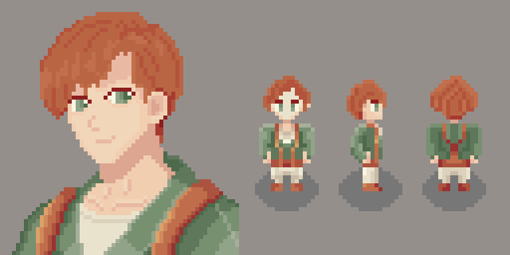

# TEMPEST
The game is natively created in pure C, using RayLib and cJSON.  
For now, I will update it as time and the project progress. Since it is a personal project, it will be developed at a slow pace.

### ¡Meet our protagonist!
## Simon

## Version
#### Alpha V0.2.0

## Changelog
You can see all updates and changes. [HERE](CHANGELOG.md).

## Features
- 2D Gameplay: The game offers a two-dimensional experience, focusing on classic gameplay mechanics and visual style.

- Developed in Pure C: The entire codebase is written in pure C, providing efficient performance and a deep understanding of low-level programming concepts.

- Built with RayLib: Utilizing RayLib, a simple and easy-to-use library for game programming, the game benefits from its straightforward API and cross-platform capabilities. RayLib supports multiple platforms, including Windows, Linux, macOS, Raspberry Pi, Android, and HTML5, making it versatile for various deployment scenarios. [RayLib](https://www.raylib.com/?utm_source=chatgpt.com)

## Installation

- Not for now, you need the Debug version.
    
## Authors

- [@ATC92](https://www.github.com/ATC92)

## Feedback
For feedback, please send me a TXT file with all the detailed comments. 
- a2201636@uabc.edu.mx

## License

[MIT](https://choosealicense.com/licenses/mit/)

## Badges

Add badges from somewhere like: [shields.io](https://shields.io/)

